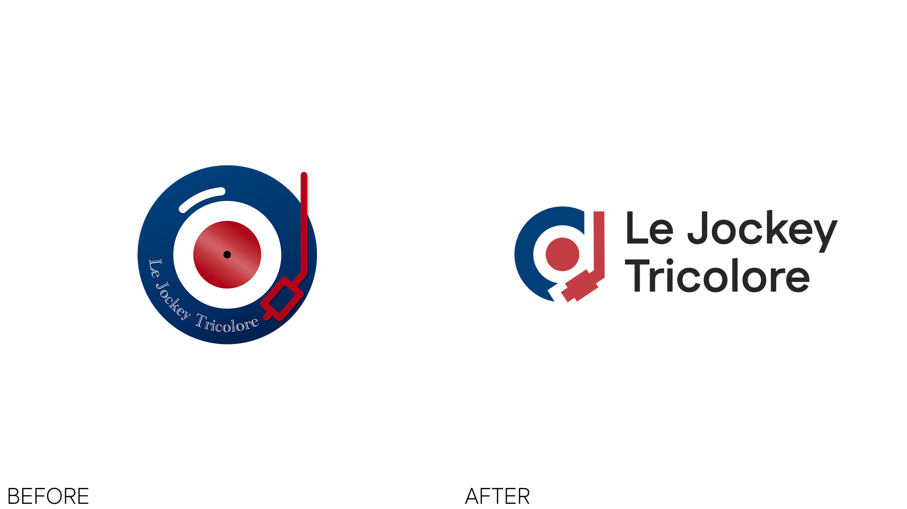

## Vue d'ensemble

Le Jockey Tricolore est un collectif de DJs français qui propose de l'animation musicale pour mariages, événements d'entreprise et soirées privées. Le logo d'origine, un disque vinyle détaillé avec une typo manuscrite courbée et un petit bras de platine, ne tenait pas la route en petit format et paraissait daté face au branding moderne du secteur événementiel. J'ai mené une refonte complète du signe en gardant le nom et l'identité tricolore intacts.

## Avant / après

L'ancien signe était un badge circulaire plat avec un lettrage manuscrit fin qui devenait illisible en dessous de ~80 px. Le nouveau est un monogramme : un "d" stylisé fusionné avec un disque vinyle et un arc de casque audio, accompagné d'un wordmark sans-serif épuré qui s'empile ou se pose en ligne.

## Objectifs de design

- **Scalable** : le signe doit rester lisible du favicon jusqu'à la signalétique
- **Reconnaissable** : conserver la palette tricolore (bleu marine + rouge)
- **Moderne** : abandonner la cursive et le détail vinyle ornemental au profit de formes géométriques fortes
- **Flexible** : le symbole fonctionne seul sur fond clair ou sombre

## Le signe

Le nouveau symbole intègre trois idées dans une forme unique :

- Un **disque vinyle** (disque bleu marine avec étiquette rouge centrale)
- Un **"d" minuscule** pour "DJ", construit à partir du négatif et de l'accent rouge
- Un **arc de casque audio** qui balaie le côté droit en rouge

Retirer la mention circulaire en cursive a libéré la composition pour qu'elle respire et fonctionne en icône seule (avatar, favicon, app tile) sans perdre sa reconnaissance de marque.

## Typographie

L'ancienne cursive a été remplacée par un wordmark sans-serif géométrique moderne, posé sur deux lignes ("Le Jockey / Tricolore") pour un empilement équilibré. Des verrouillages horizontaux en ligne sont aussi disponibles pour les formats larges (en-têtes de site, bannières d'événements).

## Livrables

- Logo principal (verrouillages horizontal et empilé)
- Symbole / app icon / favicon autonomes
- Système couleur basé sur le tricolore français (bleu marine #0B2545, rouge #C8102E)
- Règles typographiques
- Bannière de site et assets sociaux

## Ce que j'en ai tiré

Refondre une entreprise locale établie, c'est respecter ce que les clients reconnaissent déjà. La palette tricolore et le clin d'œil au vinyle sont restés ; tout l'ornemental est parti. Résultat : un signe qui survit à 16 px et qui tient encore en fond de scène.
