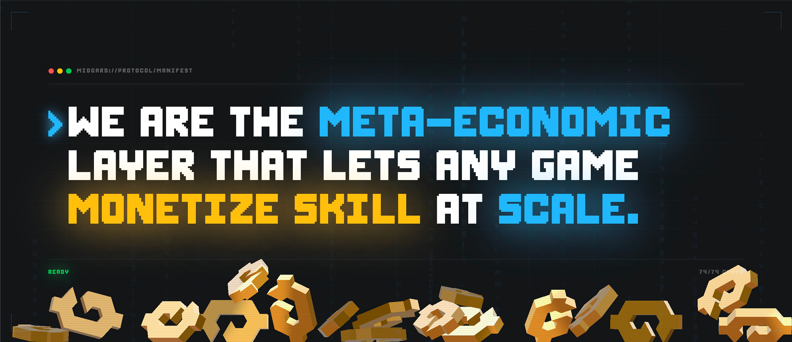
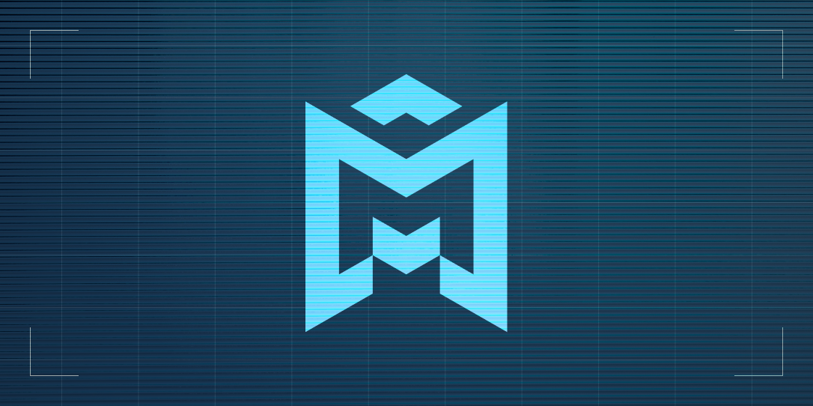
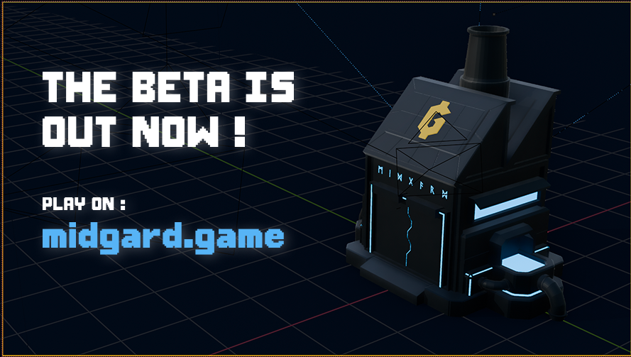
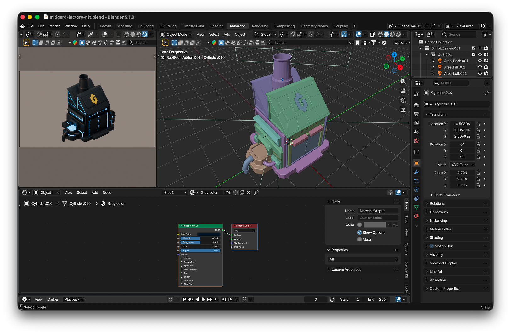
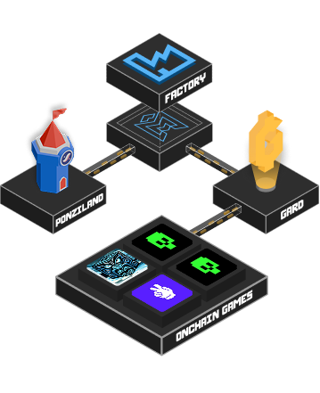

## Vue d'ensemble

Midgard transforme les scores de jeu en marchés compétitifs. Les Factory Owners choisissent un jeu, fixent un score cible, et stakent du capital. Les Challengers achètent des tickets pour tenter de battre le score : les défaites alimentent l'usine, les victoires paient le challenger. Les Vault Investors fournissent du capital et touchent des rendements de prêt. Des prize pools saisonniers récompensent les meilleurs.

Live sur [midgard.game](https://midgard.game), docs sur [docs.midgard.game](https://docs.midgard.game), beta sur [beta.midgard.game](https://beta.midgard.game). Construit par [RuneLabs](https://github.com/RuneLabsxyz) (la même équipe que PonziLand).

## Mon rôle

Dev full-stack et direction artistique sur le code, la 3D et la marque :

- **Frontend** : app SvelteKit 5, Svelte 5 runes, TailwindCSS
- **Backend** : routes serveur, logique de session, endpoints API
- **Base de données** : schéma PostgreSQL avec Drizzle ORM
- **Onchain** : contrats Cairo sur Starknet via Dojo pour les usines, les stakes et la comptabilité du vault
- **Indexation** : Torii + indexers custom pour streamer l'état onchain dans l'app
- **3D / Visuel** : assets Blender (usine, parcelles, props), intégration Three.js dans l'app, design de marque + logo

## Défis techniques

### Économie à trois rôles

Équilibrer Factory Owners, Challengers et Vault Investors pour que chaque rôle ait une espérance positive dans une certaine condition de marché. La taille des stakes, le prix des tickets et le rendement du vault interagissent ; les maths onchain doivent rester cohérentes avec les odds visibles côté UI.

### Vérification des scores

Les scores viennent de mini-jeux joués in-app. Empêcher la fraude tout en gardant l'UX fluide a demandé des preuves de session signées et des replay checks côté serveur avant tout règlement onchain.

### Svelte 5 runes à grande échelle

Migration depuis les stores Svelte 4 vers `$state` / `$derived` / `$effect`. La réactivité est plus explicite mais demande de la discipline pour éviter les tempêtes d'effets entre composants.

### Sync onchain ↔ offchain

Les usines, les stakes et les positions de vault vivent onchain ; les sessions de jeu et le matchmaking vivent offchain. La sync event-driven via Torii garde les deux côtés cohérents ; la gestion des reorgs et des timeouts sont les bords coupants.

## Identité visuelle

### Logo

Le wordmark Midgard pose un sans-serif épais légèrement biseauté à côté d'un glyphe "M" stylisé qui évoque une silhouette d'usine : deux cheminées, une toiture en pente. Objectif : lire industriel / mercantile sans tomber dans les clichés crypto-tech (pas de gradient, pas de lignes de circuit). Aplats, fort contraste, une seule couleur d'accent pour que le signe survive sur des arrières-plans de jeu chargés comme en favicon minuscule.

### Header & bannières

L'art du header utilise l'usine isométrique comme ancre, avec le wordmark verrouillé sur une baseline cohérente. Les variantes de bannière beta réutilisent le même rendu d'usine pour garder la reconnaissance cross-surface bien serrée.

## Assets 3D dans Blender

Chaque visuel hero du site et de l'app vient d'une seule scène Blender. Une seule source de vérité signifie que silhouettes, matériaux et lighting restent cohérents entre la landing page, les bannières d'app, le marketing et la 3D in-world.

- **Modèle d'usine** : bloc industriel low-to-mid-poly, matériaux PBR custom, ambient occlusion baked pour les rendus hero isométriques
- **Rendus isométriques** : caméra orthographique sur un rig fixe 30°/45°, calé sur la grille du jeu, pour que l'art marketing 2D et la vue 3D in-app partagent le même angle
- **Export GLTF** : les mêmes meshes nourrissent le runtime web (compression Draco, textures KTX2), pour que ce qui ship en Three.js matche les rendus marketing pixel-pour-vibe
- **Réglages Blender Cycles** : rendus low-sample dénoisés pour itérer, passes high-sample pour les hero frames (voir mon [post checklist render Blender](/blog/blender-cycles-fast-render-checklist))

## Intégration Three.js

La vue 3D in-app est construite sur **Three.js** via **Threlte** (les bindings Svelte de Three.js), pour que les composants 3D se composent comme n'importe quel autre composant Svelte 5 et partagent la même réactivité `$state`/`$derived`.

Pipeline :

- Blender → GLTF (compression Draco des meshes, textures KTX2) → hébergé en assets statiques
- Loader `<GLTF>` dans Threlte, instanced meshes pour les parcelles/props répétés
- Caméra orthographique alignée sur l'angle de rendu Blender, pour que la vue 3D ↔ l'art marketing ne se décrochent jamais
- Post-processing : léger bloom sur l'émission de l'usine, SSAO pour ancrer les objets, tonemapping calé sur la sortie Blender
- Budget : un canvas 3D par scène, lazy-loaded sur la route, viser 60fps sur laptops mid-tier et ~30fps sur mobile

Pourquoi Three.js plutôt qu'une boucle d'image pré-rendue : les usines doivent refléter l'état onchain live (stakes, locataires, tendances de score). La 3D live lie le retour visuel directement à l'économie du jeu, au lieu de la simuler avec des swaps de sprites.

## Fonctionnalités clés

- **Factories** : compétitions de score stakées par les Factory Owners
- **Ticket challenges** : mécanique pay-to-attempt, le winner prend le stake
- **Vaults** : pools de capital qui touchent du yield depuis le flux des usines
- **Prize pools saisonniers** : récompenses basées sur la performance, par saison
- **Wallet Starknet** : intégration Cartridge Controller pour des sessions gasless
- **Dashboard** : stats d'usine, leaderboards, positions de vault

## Ce que j'en ai tiré

- Concevoir un marché à trois côtés qui reste fun et solvable
- Livrer des contrats Cairo/Dojo en parallèle d'une app SvelteKit 5
- Patterns anti-cheat pour les jeux onchain basés sur le score
- Opérer une beta avec de vrais stakes et de vrais utilisateurs
- Posséder un pipeline visuel complet (source Blender → GLTF → runtime Three.js → rendus marketing) depuis une seule scène
