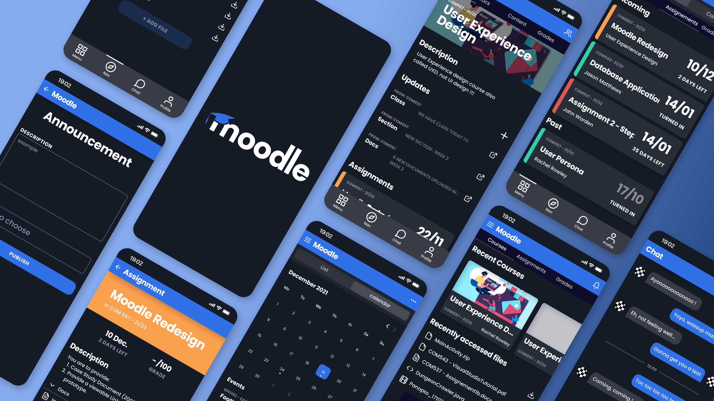

## Vue d'ensemble

Refonte UX/UI complète de l'app mobile Moodle, produite intégralement dans Figma pendant mes cours d'UX à Wrexham University. Objectif : prendre un outil que les étudiants utilisent tous les jours sans plaisir et reconstruire l'expérience mobile autour de la clarté, du focus et de patterns d'interaction modernes.

## Le problème

Moodle est la colonne vertébrale du travail scolaire dans des milliers d'universités, mais son app mobile ressemble à un wrapper fin par-dessus le site desktop. L'information est dense, la navigation est éclatée, et les tâches étudiantes les plus courantes (vérifier les devoirs à venir, lire les annonces, accéder aux fichiers récents) prennent trop de taps. Au final, les étudiants retournent sur la version web.

## Approche

La refonte est restée ancrée dans les vrais workflows étudiants plutôt que de courir après la nouveauté visuelle :

- **Audit** — cartographie de chaque flux clé de l'app existante et logging des frictions
- **Recherche** — entretiens informels avec des camarades sur leur utilisation hebdomadaire de Moodle
- **Reframe** — l'app a été traitée comme un dashboard étudiant d'abord, un catalogue de cours ensuite
- **Design** — mockups haute fidélité dans Figma avec un thème dark-first, une typo affirmée et des accents par cours codés en couleur

## Écrans clés

- **Home** — devoirs à venir, cours récents et fichiers récemment consultés sur une seule vue scrollable
- **Détail de cours** — description, mises à jour, devoirs et docs regroupés sous un hero clair
- **Vue devoir** — date limite, note, description et fichiers attachés sur un seul écran, avec un compte à rebours visible
- **Annonces** — flux de rédaction et publication simplifié à un seul formulaire
- **Calendrier** — grille mensuelle avec événements codés en couleur et liste d'événements scannable
- **Chat** — messagerie directe légère pour la collaboration au niveau du cours

## Design system

Construction d'un petit système cohérent dans Figma : échelle typo, tokens de spacing, bibliothèque de composants pour les cards, onglets et contrôles de formulaire, palette de couleurs avec accents bleu et orange saturés sur un fond quasi-noir. Chaque cours a sa propre barre d'accent pour que les étudiants parsent le dashboard d'un coup d'œil sans lire les labels.

## Ce que j'en ai tiré

Refondre un outil que les gens sont obligés d'utiliser, c'est différent de designer un truc qu'ils choisissent. La victoire ce n'est pas l'enchantement, c'est de retirer les petites frictions qui s'accumulent sur un semestre. Chaque tap économisé sur "qu'est-ce qui est dû cette semaine" est une raison de moins de retourner sur le site desktop.
