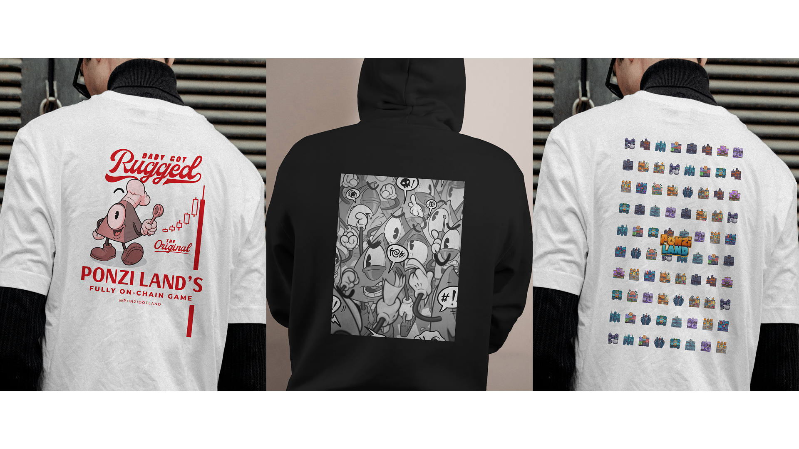

## Vue d'ensemble

PonziLand est un métagame DeFi 100 % onchain et token-agnostic sur Starknet. Les joueurs achètent, vendent et gèrent des parcelles virtuelles tout en s'affrontant sur des stratégies économiques. Toute la logique de jeu vit entièrement sur la blockchain via des smart contracts Cairo construits avec le framework Dojo.

Landing page : [ponzi.land](https://ponzi.land). Jouer : [play.ponzi.land](https://play.ponzi.land).

## Mon rôle

Je travaille comme dev full-stack sur PonziLand, en contribuant sur l'ensemble du stack :

- **Développement frontend** : construction de la web app SvelteKit avec un système d'UI modulaire à base de widgets
- **Développement de smart contracts** : écriture et maintenance de contrats Cairo pour les mécaniques de jeu (achat, claim, enchères, nuking)
- **Services backend** : développement d'un indexer et d'un méta-indexer en Rust pour le traitement des données blockchain

## Défis techniques

### Architecture multi-langage

Coordonner trois langages (TypeScript, Cairo, Rust) demande un design d'API soigné et une synchronisation fine entre couches. Chaque composant a ses paradigmes et contraintes.

### Logique de jeu onchain

Toutes les mécaniques centrales sont 100 % onchain : chaque action de jeu est une transaction blockchain. Cela impose d'optimiser les coûts en gas tout en maintenant un état de jeu complexe.

### Système de widgets

Le frontend utilise une architecture de widgets modulaire pour l'extensibilité. Chaque widget est autonome avec sa propre gestion d'état via les Svelte 5 runes ($state, $derived, $effect).

## Fonctionnalités clés

- **Design token-agnostic** : prend en charge plusieurs tokens pour les transactions de parcelles
- **Gestion des terres** : achat, vente, claim de taxes auprès des parcelles voisines
- **Système d'enchères** : enchères automatisées sur les parcelles abandonnées ou nukées
- **Méta-indexer** : enrichit les données blockchain pour des requêtes rapides avec cache PostgreSQL
- **Mises à jour temps réel** : état de jeu live synchronisé depuis les événements blockchain

## Merch

J'ai aussi designé du merch pour le projet : hoodies et t-shirts avec des illustrations originales et les tuiles de terres in-game.

## Ce que j'en ai tiré

Travailler sur PonziLand a approfondi ma maîtrise de :

- Construire des applications 100 % onchain avec un état complexe
- Le framework Dojo et les patterns de smart contracts Cairo
- La programmation async en Rust pour l'indexation blockchain
- Concevoir des architectures frontend extensibles avec Svelte 5
