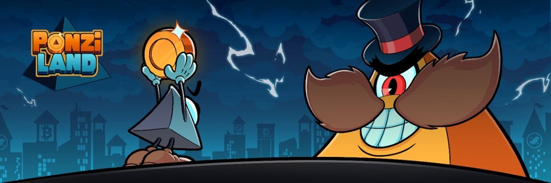
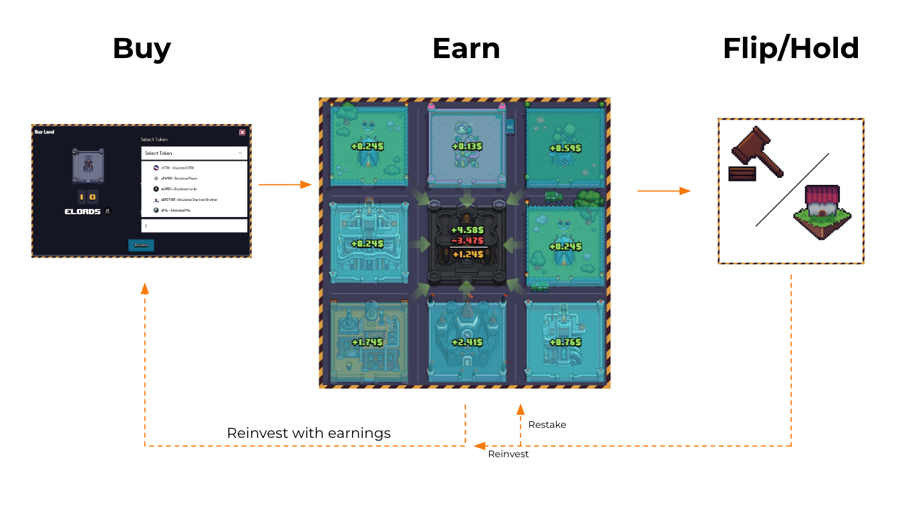
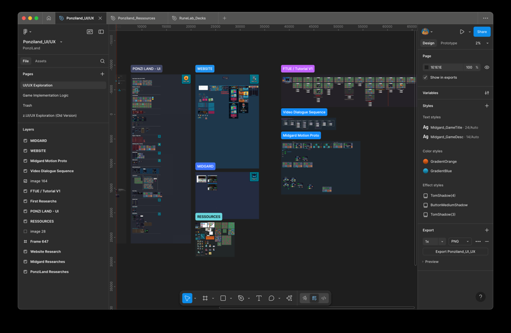
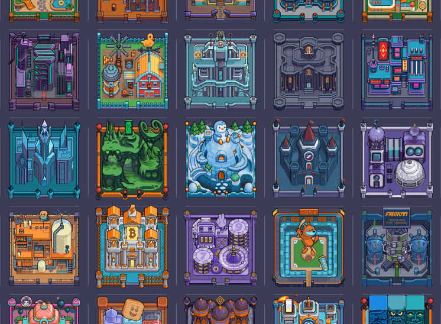
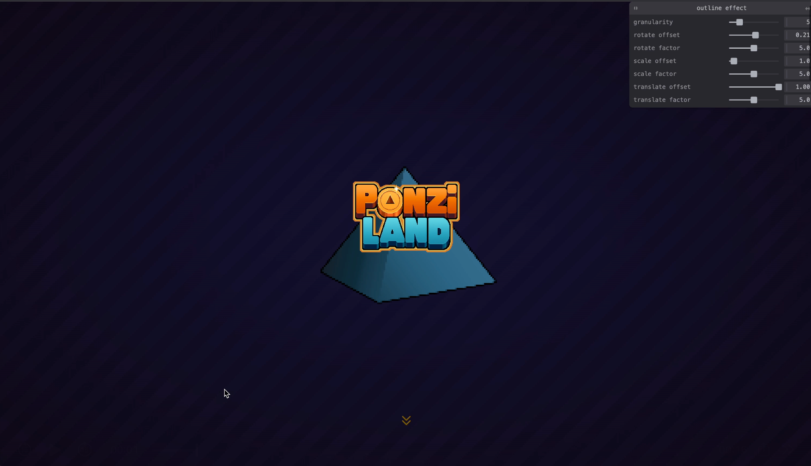

## Contexte du projet

PonziLand est un jeu de stratégie financière multijoueur reposant sur la blockchain Starknet. Les joueurs achètent, vendent et exploitent des parcelles virtuelles dont les règles économiques sont exécutées via des smart contracts.

L'enjeu était de rendre cette infrastructure complexe invisible pour l'utilisateur, avec une expérience aussi fluide qu'une application web classique, tout en supportant une carte de plus de 64 000 parcelles et des données mises à jour en temps réel.

Landing page : [ponzi.land](https://ponzi.land). Jouer : [play.ponzi.land](https://play.ponzi.land).

La boucle de jeu tient en trois temps : acheter une parcelle en misant un token, encaisser les taxes des voisins, puis revendre ou conserver.

## Déroulé de la mission

J'ai participé au développement du produit de bout en bout, avec une forte responsabilité sur le frontend, l'expérience utilisateur et les performances.

J'ai notamment travaillé sur :

- le développement du MVP en SvelteKit et TypeScript ;
- la conception des principales interfaces et interactions du jeu ;
- l'intégration des smart contracts pour les achats, ventes, enchères, taxes et transactions ;
- la synchronisation en temps réel des données issues de la blockchain ;
- la mise en place de services d'indexation et de traitement des données ;
- la refonte et l'optimisation du rendu de la carte avec Three.js, InstancedMesh et GLSL ;
- le développement de fonctionnalités compétitives et de tournois ;
- l'optimisation de l'architecture frontend et des structures de données pour maintenir une expérience fluide à grande échelle.

Le travail d'interface est parti d'un espace Figma partagé avec l'équipe, où les écrans, la FTUE et les composants ont été explorés avant d'être portés en code.

Chaque token supporté par le jeu possède son propre bâtiment et ses niveaux d'évolution, soit plusieurs dizaines de sprites à intégrer et à afficher sur la carte.

La refonte du rendu en Three.js a remplacé le DOM par des InstancedMesh et des shaders GLSL, avec un panneau de réglage des effets en temps réel pendant le développement.

## Impact chiffré

- **64 000+ parcelles** gérées et affichées dans l'univers de jeu
- Environ **100 000 $ de volume de transactions**
- Optimisation de certaines recherches de données de **O(n) à O(1)**
- Rendu de dizaines de milliers d'éléments interactifs grâce à l'utilisation d'InstancedMesh et de shaders
- Architecture couvrant plusieurs briques techniques : frontend, smart contracts, indexation et base de données
- Produit utilisé dans un environnement multijoueur avec synchronisation des données en temps réel

## Merch

J'ai aussi designé du merch pour le projet : hoodies et t-shirts avec des illustrations originales et les tuiles de terres in-game.

## Technologies

SvelteKit, Svelte 5, TypeScript, Three.js, GLSL, Starknet, Cairo, Dojo, Cartridge, Rust, PostgreSQL.
