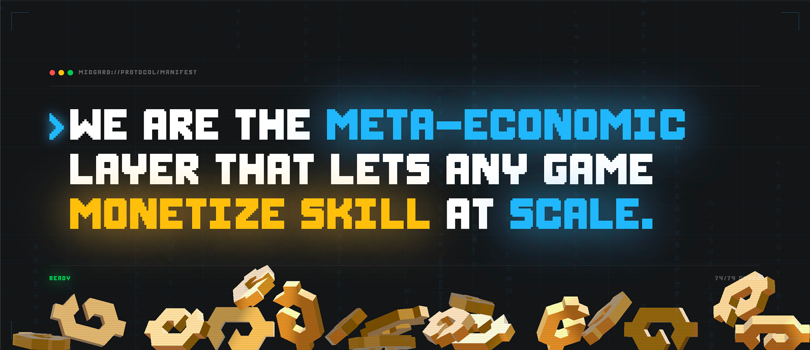
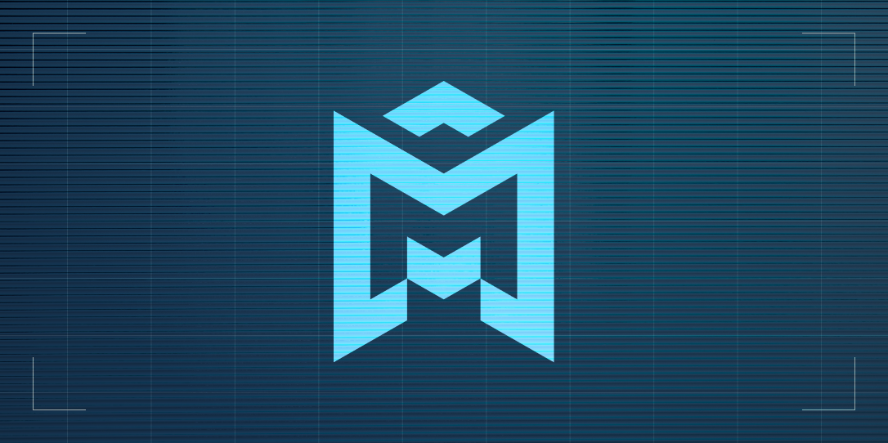
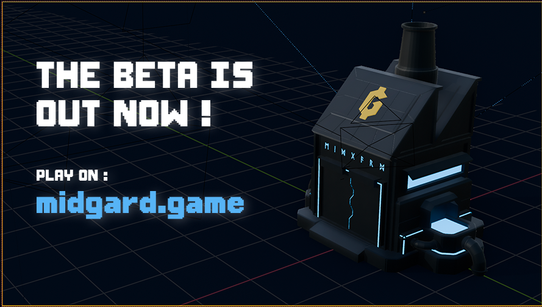
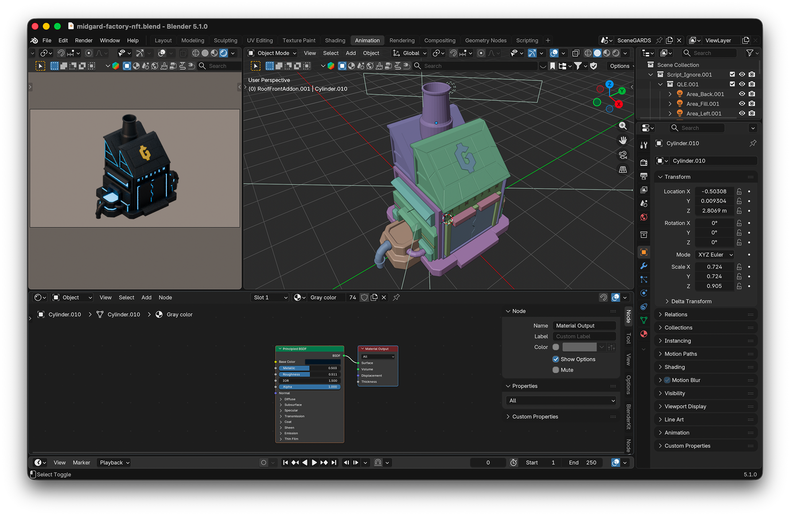
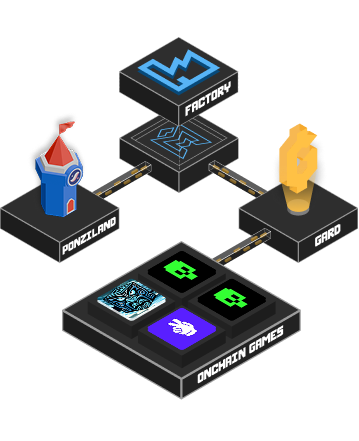

## Overview

Midgard turns game scores into competitive markets. Factory Owners select a game, set a score target, and stake capital. Challengers buy ticket attempts to beat the score — losses feed the factory, wins pay out to the challenger. Vault Investors supply capital and earn lending returns. Seasonal prize pools reward top performers.

Live at [midgard.game](https://midgard.game), docs at [docs.midgard.game](https://docs.midgard.game), beta at [beta.midgard.game](https://beta.midgard.game). Built by [RuneLabs](https://github.com/RuneLabsxyz) (same team as PonziLand).

## My Role

Full-stack dev plus art direction across code, 3D, and brand:

- **Frontend**: SvelteKit 5 app, Svelte 5 runes, TailwindCSS
- **Backend**: Server routes, game session logic, API endpoints
- **Database**: PostgreSQL schema with Drizzle ORM
- **Onchain**: Cairo contracts on Starknet via Dojo for factories, stakes, and vault accounting
- **Indexing**: Torii + custom indexers to stream onchain state into the app
- **3D / Visual**: Blender assets (factory, parcels, props), Three.js integration in-app, brand + logo design

## Technical Challenges

### Three-role Economy

Balancing Factory Owners, Challengers, and Vault Investors so every role has positive expected value in some market condition. Stake sizing, ticket pricing, and vault yield all interact — onchain math has to stay consistent with UI-visible odds.

### Score Verification

Scores come from mini-games played in-app. Preventing score forgery while keeping the UX snappy required signed session proofs and server-side replay checks before any onchain settlement.

### Svelte 5 Runes at Scale

Migrating from Svelte 4 stores to `$state` / `$derived` / `$effect`. Reactivity is more explicit but needs discipline to avoid cross-component effect storms.

### Onchain ↔ Offchain Sync

Factories, stakes, and vault positions live onchain; game sessions and matchmaking live offchain. Event-driven sync via Torii keeps both sides consistent; reorg handling and timeout expiry are the hard edges.

## Visual Identity

### Logo Design

The Midgard wordmark pairs a chunky, slightly-beveled sans with a stylized "M" glyph echoing a factory silhouette — two stacks, a tapered roofline. Goal: read as industrial / mercantile without falling into crypto-tech clichés (no gradients, no circuit lines). Flat fills, high contrast, one accent color so the mark survives on busy game backdrops and small favicon sizes alike.

### Header & Banners

The header art uses the isometric factory as the anchor, with the wordmark locked to a consistent baseline. Beta banner variants reuse the same factory render so cross-surface recognition stays tight.

## 3D Assets in Blender

Every hero visual on the site and in-app comes from a single Blender scene. One source of truth means silhouettes, materials, and lighting stay consistent across the landing page, app banners, marketing, and in-world 3D.

- **Factory model**: Low-to-mid-poly industrial block, custom PBR materials, baked ambient occlusion for the isometric hero renders
- **Isometric renders**: Orthographic camera at a fixed 30°/45° rig — matches the game grid so 2D marketing art and 3D in-app view share the same angle
- **GLTF export**: Same meshes feed the web runtime (Draco-compressed, KTX2 textures) so what ships in Three.js matches the marketing renders pixel-for-vibe
- **Blender Cycles settings**: Low-sample denoised renders for iteration, higher-sample passes for hero frames (see my [Blender render checklist post](/blog/blender-cycles-fast-render-checklist))

## Three.js Integration

The in-app 3D view is built on **Three.js** via **Threlte** (Svelte bindings for Three.js), so 3D components compose like any other Svelte 5 component and share the same `$state`/`$derived` reactivity.

Pipeline:

- Blender → GLTF (Draco mesh compression, KTX2 textures) → hosted as static assets
- `<GLTF>` loader in Threlte, instanced meshes for repeated parcels/props
- Orthographic camera matched to the Blender render angle so 3D view ↔ marketing art never feel disjoint
- Post-processing: mild bloom on factory emission, SSAO for grounding, tonemapping tuned to match the Blender output
- Budget: one 3D canvas per scene, lazy-loaded on route, targeting 60fps on mid-tier laptops and ~30fps on mobile

Why Three.js over a pre-rendered image loop: factories need to reflect live onchain state (stakes, tenants, score trends). Live 3D ties visual feedback directly to the game economy instead of faking it with sprite swaps.

## Key Features

- **Factories**: Score competitions staked by Factory Owners
- **Ticket challenges**: Pay-to-attempt, winner-takes-stake mechanic
- **Vaults**: Capital pools earning yield from factory flow
- **Seasonal prize pools**: Performance-based rewards each season
- **Starknet wallet**: Cartridge Controller integration for gasless sessions
- **Dashboard**: Factory stats, leaderboards, vault positions

## What I Learned

- Designing a three-sided market that stays fun and solvent
- Shipping Cairo/Dojo contracts alongside a SvelteKit 5 app
- Anti-cheat patterns for score-based onchain games
- Operating a beta with real stakes and real users
- Owning a full visual pipeline — Blender source → GLTF → Three.js runtime → marketing renders — from a single scene
