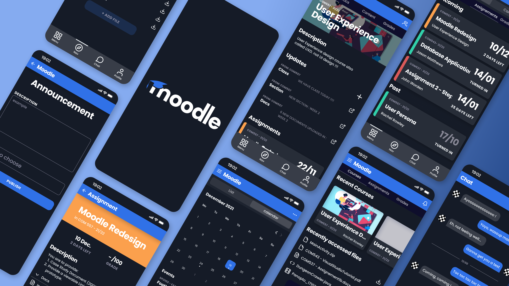

## Overview

A full UX/UI redesign of the Moodle mobile app, produced entirely in Figma during my UX classes at Wrexham University. The goal: take a tool students use every day but rarely enjoy, and rebuild the mobile experience around clarity, focus, and modern interaction patterns.

## The Problem

Moodle is the backbone of coursework for thousands of universities, but its mobile app feels like a thin wrapper over the desktop site. Information is dense, navigation is fragmented, and the most common student tasks (check upcoming assignments, read announcements, access recent files) take too many taps. Students end up on the web version anyway.

## Approach

The redesign stayed grounded in real student workflows rather than chasing visual novelty:

- **Audit** — mapped every core flow in the existing app and logged friction points
- **Research** — informal interviews with classmates about how they actually use Moodle week to week
- **Reframe** — treated the app as a student dashboard first, a course catalog second
- **Design** — hi-fi mockups in Figma with a dark-first theme, bold typography, and color-coded course accents

## Key Screens

- **Home** — upcoming assignments, recent courses, and recently accessed files surfaced on a single scrollable view
- **Course detail** — description, updates, assignments, and docs grouped under a clear hero
- **Assignment view** — deadline, grade, description, and attached files on one screen, with a prominent countdown
- **Announcements** — compose and publish flow simplified to a single form
- **Calendar** — month grid with color-coded events and a scannable event list
- **Chat** — lightweight direct messaging for course-level collaboration

## Design System

Built a small but consistent system in Figma: type scale, spacing tokens, component library for cards, tabs, and form controls, and a color palette using saturated blue and orange accents over a near-black background. Each course gets its own accent bar so students can parse the dashboard at a glance without reading labels.

## What I Learned

Redesigning a tool people are forced to use is different from designing something they choose to use. The win isn't delight, it's removing small frictions that compound over a semester. Every tap you save on "check what's due this week" is one less reason to bounce back to the desktop site.
