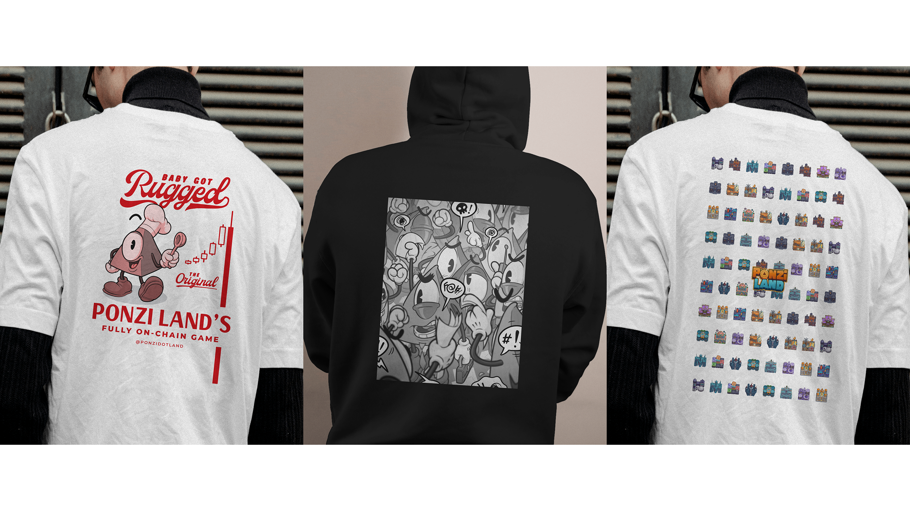

## Overview

PonziLand is a fully onchain, token-agnostic DeFi metagame built on Starknet. Players buy, sell, and manage virtual land parcels while competing in economic strategies. All game logic lives entirely on the blockchain through Cairo smart contracts using the Dojo framework.

Landing page: [ponzi.land](https://ponzi.land). Play the game: [play.ponzi.land](https://play.ponzi.land).

## My Role

I work as a full-stack developer on PonziLand, contributing across the entire stack:

- **Frontend Development**: Building the SvelteKit web application with a modular widget-based UI system
- **Smart Contract Development**: Writing and maintaining Cairo contracts for game mechanics (buying, claiming, auctions, nuking)
- **Backend Services**: Developing Rust-based indexer and meta-indexer services for blockchain data processing

## Technical Challenges

### Multi-Language Architecture

Coordinating three different languages (TypeScript, Cairo, Rust) requires careful API design and data synchronization between layers. Each component has its own paradigms and constraints.

### Onchain Game Logic

All core mechanics are fully onchain, meaning every game action is a blockchain transaction. This requires optimizing for gas costs while maintaining complex game state.

### Widget System

The frontend uses a modular widget architecture allowing easy extension. Each widget is self-contained with its own state management using Svelte 5 runes ($state, $derived, $effect).

## Key Features

- **Token-Agnostic Design**: Supports multiple tokens for land transactions
- **Land Management**: Buy, sell, claim taxes from neighboring lands
- **Auction System**: Automated auctions for abandoned or nuked lands
- **Meta-Indexer**: Enriches blockchain data for fast queries with PostgreSQL caching
- **Real-time Updates**: Live game state synchronized from blockchain events

## Merch

I also designed merchandise for the project: hoodies and tees featuring original illustrations and the in-game land tiles.

## What I Learned

Working on PonziLand deepened my understanding of:

- Building fully onchain applications with complex state
- The Dojo framework and Cairo smart contract patterns
- Rust async programming for blockchain indexing
- Designing extensible frontend architectures with Svelte 5
